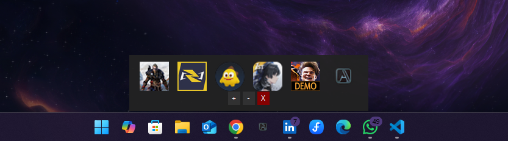
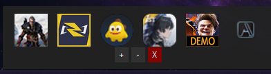
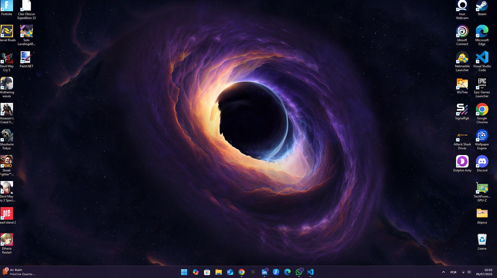
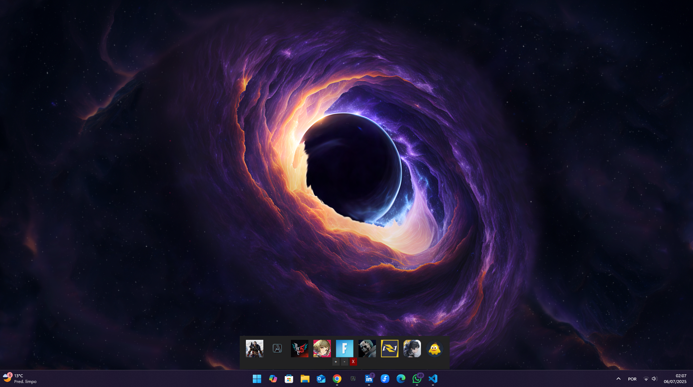

# 🚀 Minha Dock: Um Lançador de Aplicativos Minimalista para Windows

[](https://github.com/AndrewBlack21/Dock-Taskbar-Python/releases/latest)
[](https://github.com/AndrewBlack21/Dock-Taskbar-Python/releases/latest)
[](LICENSE)

## 🎯 Sobre o Projeto

Minha Dock é um lançador de aplicativos minimalista e discreto para Windows, projetado para otimizar o acesso rápido aos seus programas e atalhos favoritos. **É a solução ideal para quem busca uma área de trabalho limpa e minimalista, sem a poluição visual de múltiplos ícones espalhados.** Ele funciona como uma barra flutuante, aparecendo quando você precisa e se escondendo para não atrapalhar sua área de trabalho.

Desenvolvido em Python com Tkinter e a poderosa biblioteca `pywin32`, esta dock oferece uma experiência de usuário limpa e eficiente.



### ✨ Funcionalidades Principais

* **Adicionar Atalhos Facilmente:** Adicione executáveis (`.exe`), atalhos (`.lnk`), URLs de internet (`.url`), arquivos Batch (`.bat`, `.cmd`) ou ícones (`.ico`) diretamente à dock.
* **Remoção Seletiva:** Remova atalhos específicos através de uma interface intuitiva de seleção.
* **Ícones Dinâmicos:** Tenta extrair automaticamente o ícone do aplicativo/atalho. Caso não consiga, usa um ícone padrão (ou um quadrado cinza para garantir a visibilidade).
* **Posicionamento Automático:** A dock se ajusta e se posiciona automaticamente no centro inferior da tela, um pouco acima da barra de tarefas do Windows, independentemente da resolução do monitor.
* **Instância Única:** Garante que apenas uma cópia da dock esteja em execução. Se você tentar abri-la novamente, a instância existente é trazida para o primeiro plano.
* **Comportamento Dinâmico:**
    * **Fechamento por Clique:** A dock se fecha automaticamente após iniciar um aplicativo a partir dela.
    * **Botão de Fechar:** Um botão 'X' permite fechar a dock explicitamente, encerrando o aplicativo.
    * **Auto-Ocultar por Inatividade:** A dock se esconde automaticamente após um período de inatividade do mouse sobre ela.
* **Persistência de Atalhos:** Os atalhos adicionados são salvos automaticamente e carregados na próxima vez que você iniciar a dock.
* **Open Source:** Código-fonte aberto e disponível para colaboração.

## 🚀 Como Instalar e Usar

A forma mais fácil de usar a Minha Dock é baixando o executável pré-compilado. Você não precisa ter Python instalado!

📸 Prévia da Minha Dock

Aqui você pode ver a Minha Dock em ação na área de trabalho, mostrando diferentes estados e usos:

### Dock com Barra de Tarefas (Exemplo de Posicionamento)


### Dock Minimalista



### Área de Trabalho com Muitos Ícones (Antes da Organização)



### Área de Trabalho Vazia (Após Organização com a Dock)



### 📥 Download do Executável

1.  Vá para a seção de [**Releases**](https://github.com/AndrewBlack21/Dock-Taskbar-Python/releases) do repositório.
2.  Baixe o arquivo `MinhaDock.exe` (ou o nome mais recente disponível) da última versão estável.
3.  Execute o arquivo `MinhaDock.exe`.

### 💻 Uso da Aplicação

Ao iniciar a `MinhaDock.exe`:

* A dock aparecerá automaticamente no centro inferior da sua tela.
* **Adicionar Atalhos:** Clique no botão `+` e selecione o arquivo (executável, atalho, .url, etc.) que deseja adicionar.
* **Remover Atalhos:** Clique no botão `-` e uma janela pop-up listará os atalhos. Digite o número correspondente ao atalho que deseja remover.
* **Abrir Aplicações:** Clique no ícone de uma aplicação na dock para iniciá-la. A dock se fechará automaticamente.
* **Fechar a Dock (Encerrar Aplicação):**
    * Clique no botão `X` na dock.
    * Mova o mouse para fora da dock e aguarde `10 segundos` (tempo configurável no código) para que ela se feche automaticamente.
* **Reabrir a Dock:** Se a dock estiver fechada e você tentar abri-la novamente (clicando no `MinhaDock.exe`), a instância existente será detectada e trazida para o primeiro plano, evitando que várias cópias do programa rodem.

## 🛠️ Contexto Técnico do Código

Este projeto é desenvolvido em Python e utiliza as seguintes bibliotecas principais:

* **`tkinter`**: A biblioteca padrão do Python para criar interfaces gráficas (GUI).
* **`Pillow` (PIL)**: Usada para manipulação de imagens, essencial para carregar e redimensionar os ícones de aplicativos.
* **`pywin32`**: Uma suíte de módulos Python para Windows que fornece acesso a muitas APIs do Windows (como manipulação de janelas, extração de ícones, gerenciamento de mutex). Crucial para funcionalidades como:
    * `win32gui`, `win32api`, `win32con`, `win32ui`, `win32event`, `winerror`: Utilizados para interagir com o sistema de janelas do Windows, extrair ícones de executáveis e atalhos, e implementar o controle de instância única (mutex nomeado).
    * `win32com.client.Dispatch`: Usado para resolver caminhos de atalhos (`.lnk`) e URLs (`.url`).
* **`subprocess`**: Para executar os aplicativos e atalhos.
* **`os`, `json`, `configparser`, `ctypes`, `sys`**: Para gerenciamento de arquivos, persistência de dados (JSON), leitura de arquivos `.url`, interação de baixo nível com o sistema e detecção de ambiente PyInstaller.

### 📁 Estrutura de Arquivos Essenciais

* `seu_script.py` (ou `index.py`): O código-fonte principal da sua aplicação dock.
* `atalhos.json`: O arquivo onde os atalhos adicionados são salvos. Ele é armazenado em um diretório persistente no sistema do usuário (`AppData` no Windows) quando a aplicação é compilada.
* `default_icon.ico`: O ícone padrão usado quando um ícone de aplicativo não pode ser extraído.

## 🐛 BUGS Conhecidos e Oportun

Como todo projeto em desenvolvimento, a Minha Dock pode apresentar alguns bugs ou ter funcionalidades a serem aprimoradas. **Se você é um desenvolvedor e busca um projeto open source para contribuir, sinta-se à vontade!**

Aqui estão alguns dos bugs conhecidos e áreas para colaboração:

* **Adição de Ícones:** Atualmente, é possível adicionar apenas alguns tipos de ícones. Melhorias na detecção e extração de ícones de diferentes formatos e fontes são bem-vindas.
* **Dependência de Atalho:** Se um atalho (ou o arquivo original) for excluído da área de trabalho ou de sua localização original, ele também deixará de funcionar na aplicação. Uma melhor gestão de atalhos "quebrados" pode ser implementada.
* **Comportamento de Ocultamento:** A dock atualmente permanece na tela por 10 segundos após o mouse sair dela antes de fechar. Uma opção de configuração para este tempo ou um comportamento de ocultamento mais dinâmico (ex: ao clicar fora da dock) seria útil.
* **Carregamento de Imagens:** Algumas imagens de ícones podem não carregar corretamente. Aprimoramentos na rotina de extração e carregamento de ícones são necessários para garantir a compatibilidade com uma gama maior de arquivos.

## 🤝 Como Contribuir

Contribuições são bem-vindas! Se você tiver ideias, melhorias de código, ou encontrar bugs, sinta-se à vontade para:

1.  **Faça um "Fork"** deste repositório para sua conta GitHub.
2.  **Clone o seu Fork** para sua máquina local (`git clone https://github.com/SeuUsuario/Dock-Taskbar-Python.git`).
3.  Crie uma **Branch** para sua feature/correção (`git checkout -b feature/sua-feature` ou `bugfix/nome-do-bug`).
4.  Faça suas **alterações** e **commits** (`git commit -m 'feat: adiciona nova funcionalidade X'` ou `fix: corrige bug de Y'`).
5.  Envie suas alterações para o seu Fork (`git push origin feature/sua-feature`).
6.  Abra um **Pull Request** para o repositório original, explicando suas mudanças.

### Requisitos para Desenvolvedores

Para rodar e desenvolver a aplicação localmente, você precisará:

* **Python 3.x**
* **Pip** (gerenciador de pacotes do Python)

Instale as dependências necessárias:

```bash
pip install pyinstaller pywin32 pillow
